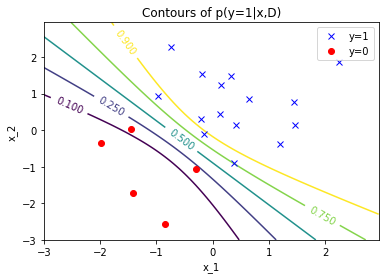

# Stochastic Variational Inference

These are the examples from the course MLPR at University of Edinburgh with professor Iain Murray. The original code can be found in the .py files, jupyter notebook has important annotations, derivations and clarification about the code an maths

The final result should be something like

